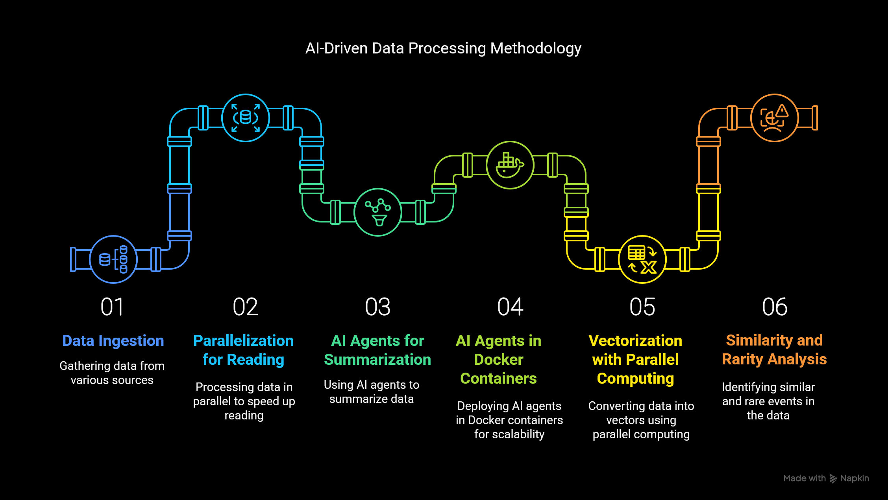
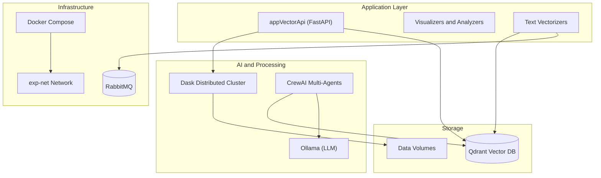

# Privacy-Preserving Techniques for Textual Data in AI Models

**Dissertation Experiment 01**

> **Author**: Daniel Linhares Lim-Apo
> **Institution**: University of Brasília (UnB) - Professional Master’s Degree in Applied Computing
> **Advisor**: Prof.a Dr.a Edna Dias Canedo

## Abstract

Processes that aim to extract value from stored data are gaining prominence. Among various types of unstructured data, textual data constitutes a significant proportion of the information produced in real-world settings. Ethical considerations and data protection laws have increased the pressure over the privacy of sensitive content. The disclosure risks associated with textual data, considering differential privacy, are influenced by the rarity and the similarity of texts within a dataset.

This project implements the experimental case study for the dissertation: **"Privacy-Preserving Techniques for preparing texts for use in artificial intelligence models: Leveraging Semantic Similarity with Vector Data Search and AI Agents"**.

It explores state-of-the-art techniques for privacy preservation in text processing, utilizing Semantic Similarity, Vector Databases (Qdrant), and AI Agents (LLMs) to detect rare events and mitigate re-identification risks.

## Methodology



The experimental case study follows a 6-step AI-driven data processing pipeline:

1. **Data Ingestion**
   - [csv_reader](src/csv_reader) / [parquet_reader](src/parquet_reader): Services responsible for gathering data from various sources (CSV, Parquet) to feed the pipeline.

2. **Parallelization for Reading**
   - [dask-csv-worker-flow-1-Without-AI](src/dask-csv-worker-flow-2): Utilizes Dask for parallel data processing to speed up the reading and initial handling of large datasets.

3. **AI Agents for Summarization**
   - [appCrewaiMultiAgents](src/appCrewaiMultiAgents): Deploys a crew of AI agents (using CrewAI) to synthesize and summarize textual data.

4. **AI Agents in Docker Containers**
   - [docker-compose.yml](src/docker-compose.yml): The entire multi-agent system and microservices are containerized and orchestrated for scalability and ease of deployment.

5. **Vectorization with Parallel Computing**
   - [text-vectorizer-flow-2-With-AI](src/text-vectorizer-flow-2-With-AI): Converts processed text into high-dimensional vectors using parallel computing techniques for efficient storage in Qdrant.

6. **Rare Events Detection**
   - [app-Qdrant-Analyzer-Flow-2](src/app-Qdrant-Analyzer-Flow-2): Identifies rare events or outliers within the vectorized data stored in Qdrant.

## Architecture

The system is built as a microservices architecture orchestrated by Docker Compose.



## Key Components

### 🧠 AI & Agents

- **Ollama**: Local hosting of Large Language Models (LLMs) for inference.
- **CrewAI Multi-Agents** (`appcrewaimultiagents`): Orchestrates AI agents for complex reasoning tasks involving privacy analysis.

### 🔍 Vector Search & Database

- **Qdrant**: High-performance vector database used to store and search text embeddings.
- **Vector API** (`appVectorApi`): FastAPI service acting as the gateway for vectorization and search operations.
- **Visualizers**: `appVectorVisualizer` and `app-Qdrant-Visualizer` for exploring the vector space.

### ⚡ Distributed Processing

- **Dask**: Provides scalable parallel computing for processing large textual datasets (`daskscheduler`, `daskworker`).

## Installation & Usage

### Prerequisites

- **Docker** and **Docker Compose** installed.
- **Docker** running (try starting Docker Desktop or Rancher Desktop) (Check with `docker info` command).
- (Optional) NVIDIA GPU with container toolkit support for accelerated Ollama/Qdrant performance.

### Setup

1.  **Clone the repository:**

    ```bash
    git clone <repository-url>
    cd <repository-directory>
    ```

2.  **Configuration:**
    The services in `src/docker-compose.yml` are configured to use specific host paths for data and output (e.g., `D:/DockerVolumes/privacy/RareEvents/data`).

    > [!IMPORTANT]
    > You must have these directories available on your host machine or create a new folder structure to use for the data. If you use a different path, you **must update all volume mappings** in [docker-compose.yml](src/docker-compose.yml) to match your local setup:

    ```yaml
    volumes:
      - /your/local/path/data:/data
      - /your/local/path/output:/output
    ```

3.  **If you just want the status of the containers managed by the local docker-compose file, use:**

```bash
docker-compose ps
```

### Experimental Flows

The system's architecture supports different experimental flows. We defined two:

- **Standard Flow**: Starts the core API, Qdrant, and Dask cluster.
- **Flow 2**: Starts the secondary experimental pipeline (`dask-csv-worker-flow-2`, `text-vectorizer-flow-2`).

### Reproducibility

To reproduce the experimental results presented in the dissertation:

1.  **Environment Setup**: Ensure your Docker environment is clean.
    ```bash
    docker system prune -f
    ```

---

This command does a forced cleanup of unused Docker resources on your system.

2.  **Dataset Preparation**:

    > [!WARNING]
    > The original dataset used in this experiment contains **sensitive information** and is not publicly available. For reproducibility purposes, synthetic data can be generated following the specifications in [DATA_FORMAT.md](DATA_FORMAT.md).

    Place the input CSV files in the `data/input` directory

    For flow-2-With-AI:
    See src\dask-csv-worker-flow-2-with-ai\reader.py entry point for the exact path to the input CSV file:
    csv_path = "/data/ocorrencias.csv"

    in src\docker-compose.yml the volumes for the container dask-csv-worker-flow-2-with-ai are mapped to `/data` in the container:
    volumes:
    - D:/DockerVolumes/privacy/RareEvents/data:/data
    - D:/DockerVolumes/privacy/RareEvents/output:/output

    For flow-1-Without-AI:
    See src\dask-csv-worker-flow-1-Without-AI\reader.py entry point for the exact path to the input CSV file:
    csv_path = "/data/ocorrencias.csv"

    in src\docker-compose.yml the same volumes for the container dask-csv-worker-flow-1-Without-AI are mapped to `/data` in the container:
    volumes:
    - D:/DockerVolumes/privacy/RareEvents/data:/data
    - D:/DockerVolumes/privacy/RareEvents/output:/output

    (mapped to `/data` in the container). See [DATA_FORMAT.md](DATA_FORMAT.md) for the expected JSON format and instructions on generating synthetic test data.

3.  **Execution**:
    - For the `Flow 1 - Without AI`
      - Start the base:
        - `docker-compose build ollama qdrant daskscheduler daskworker1 daskworker2 rabbitmq`
        - `docker-compose up ollama qdrant daskscheduler daskworker1 daskworker2 rabbitmq -d`

      - If you want know if Dask is working:
        - `docker compose build dasktest`
        - `docker compose up dasktest -d`
        - See [dasktest/README.md](src/dasktest/README.md)
        - You can see the dask dashboard at `http://localhost:18787` during the processing (status, workers, tasks, graph)

      - then the csv data ingestion:
        - `docker compose build dask-csv-worker-flow-1-without-ai`
        - `docker compose up dask-csv-worker-flow-1-without-ai -d`
      - Check the messagens in RabbitMQ in Get Messages:
        - http://localhost:15672/#/queues/%2F/ocorrencias_historico_collection_flow_1_without_ai
      - Start the text vectorizer:
        - `docker compose build text-vectorizer-flow-1-without-ai`
        - `docker compose up text-vectorizer-flow-1-without-ai -d`

      - **Verification of flow-1-Without-AI**:
        - Access the Qdrant dashboard at `http://localhost:6333/dashboard` to verify that collections are created and vectors are indexed.

    - For the `Flow 2 - With AI`
      - Start the base:
        - `docker-compose build ollama qdrant daskscheduler daskworker1 daskworker2 rabbitmq`
        - `docker-compose up ollama qdrant daskscheduler daskworker1 daskworker2 rabbitmq -d`

      - If you want know if Dask is working:
        - `docker compose build dasktest`
        - `docker compose up dasktest -d`
        - See [dasktest/README.md](src/dasktest/README.md)
        - You can see the dask dashboard at `http://localhost:18787` during the processing (status, workers, tasks, graph).

      - then the csv data ingestion:
        - First prepare the data as explained in the Dataset Preparation section.
        - Then run:
        - `docker compose build dask-csv-worker-flow-2-with-ai`
        - `docker compose up dask-csv-worker-flow-2-with-ai -d`
        - Check the messagens in RabbitMQ in Get Messages:
          - http://localhost:15672/#/queues/%2F/original_text_messages
      - Process the original texts to summarize them:
        - `docker compose build text-processor-flow-2-With-AI`
        - `docker compose up text-processor-flow-2-With-AI -d`
        - Check the messagens in RabbitMQ in Get Messages:
          - http://localhost:15672/#/queues/%2F/summary_text_messages
        - Start the text vectorizer:
          - `docker compose build text-vectorizer-flow-2-With-AI`
          - `docker compose up text-vectorizer-flow-2-With-AI -d`

4.  **Reset Data**:
    To reset the data, and analyze a new dataset, you can remove the collection as following and then restart the process above:
    - Access the Qdrant
      - http://localhost:6333/dashboard#/collections
        and delete the collection:
        ocorrencias_historico_vectorized

5.  **Verification of flow-2-With-AI **:
    - Access the Qdrant dashboard at `http://localhost:6333/dashboard` to verify that collections are created and vectors are indexed.

## Service Directory

Detailed documentation for each service in the `src` folder:

### Core Services

- [app](src/app/README.md) - FastAPI service for text processing with Ollama and Qdrant
- [appCrewaiMultiAgents](src/appCrewaiMultiAgents/README.md) - Multi-agent AI system using CrewAI
- [appVectorApi](src/appVectorApi/README.md) - Vector API for Qdrant operations
- [text-processor-flow-2-With-AI](src/text-processor-flow-2-With-AI/README.md) - RabbitMQ consumer for AI-based text processing

### Data Ingestion

- [csv_reader](src/csv_reader/README.md) - Spark-based CSV to Parquet converter
- [parquet_reader](src/parquet_reader/README.md) - Parquet file reader
- [dask-csv-worker-flow-1-Without-AI](src/dask-csv-worker-flow-2/README.md) - Dask-based parallel CSV reader

### Vectorization

- [text-vectorizer-flow-2-With-AI](src/text-vectorizer-flow-2-With-AI/README.md) - Text to vector embedding service
- [text-vectorizer-flow-1-Without-AI](src/text-vectorizer-flow-1-Without-AI/README.md) - Alternative vectorization flow

### Analysis & Visualization

- [app-Qdrant-Analyzer-Flow-2](src/app-Qdrant-Analyzer-Flow-2/README.md) - Rare event detection
- [app-Qqdrant-Analyzer](src/app-Qqdrant-Analyzer/README.md) - Vector data analysis
- [app-Qdrant-Visualizer](src/app-Qdrant-Visualizer/README.md) - Qdrant visualization tool
- [appVectorVisualizer](src/appVectorVisualizer/README.md) - Streamlit vector visualizer

### Distributed Computing

- [daskscheduler](src/daskscheduler/README.md) - Dask cluster scheduler
- [daskworker](src/daskworker/README.md) - General Dask worker
- [dask-csv-worker-flow-2-with-ai](src/dask-csv-worker-flow-2-with-ai/README.md) - Specialized CSV worker
- [dasktest](src/dasktest/README.md) - Dask cluster connectivity test
- [spark](src/spark/README.md) - Apache Spark cluster
- [dask](src/dask/README.md) - Flexible library for parallel computing in Python that scales from single machines to large clusters

### Infrastructure

- [ollama](src/ollama/README.md) - **Ollama** is a local runtime for running Large Language Models (LLMs) on your own infrastructure. It provides a simple API for text generation and embeddings, allowing you to use models like Llama3 without relying on external cloud services
- [grafana](src/grafana/README.md) - **Grafana** is an open-source analytics and monitoring platform that provides interactive display of dashboards and metrics. It connects to Prometheus to display real-time metrics, system performance, and resource usage through customizable charts and graphs
- [prometheus](src/prometheus/README.md) - **Prometheus** is an open-source monitoring and alerting toolkit that collects and stores metrics as time-series data. It scrapes metrics from configured services at specified intervals and provides a query language (PromQL) for data analysis

## Citation

If you use this code or dissertation findings in your research, please cite.
