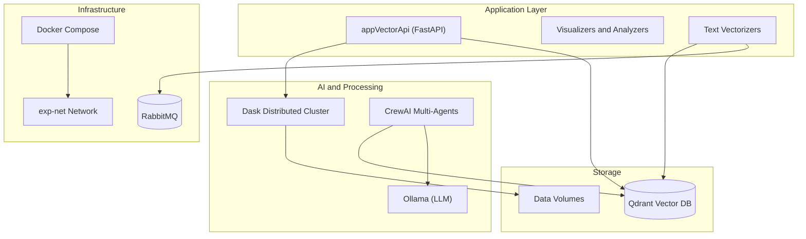

# Privacy-Preserving Techniques for Textual Data in AI Models

**Dissertation Experiment 01**

> **Author**: Daniel Linhares Lim-Apo
> **Institution**: University of Brasília (UnB) - Professional Master’s Degree in Applied Computing
> **Advisor**: Prof.a Dr.a Edna Dias Canedo

## Abstract

Processes that aim to extract value from stored data are gaining prominence. Among various types of unstructured data, textual data constitutes a significant proportion of the information produced in real-world settings. Ethical considerations and data protection laws have increased the pressure over the privacy of sensitive content. The disclosure risks associated with textual data, considering differential privacy, are influenced by the rarity and the similarity of texts within a dataset.

This project implements the experimental case study for the dissertation: **"Privacy-Preserving Techniques for preparing texts for use in artificial intelligence models: Leveraging Semantic Similarity with Vector Data Search and AI Agents"**.

It explores state-of-the-art techniques for privacy preservation in text processing, utilizing Semantic Similarity, Vector Databases (Qdrant), and AI Agents (LLMs) to detect rare events and mitigate re-identification risks.

## Architecture

The system is built as a microservices architecture orchestrated by Docker Compose.



## Key Components

### 🧠 AI & Agents
*   **Ollama**: Local hosting of Large Language Models (LLMs) for inference.
*   **CrewAI Multi-Agents** (`appcrewaimultiagents`): Orchestrates AI agents for complex reasoning tasks involving privacy analysis.

### 🔍 Vector Search & Database
*   **Qdrant**: High-performance vector database used to store and search text embeddings.
*   **Vector API** (`appVectorApi`): FastAPI service acting as the gateway for vectorization and search operations.
*   **Visualizers**: `appVectorVisualizer` and `app-Qdrant-Visualizer` for exploring the vector space.

### ⚡ Distributed Processing
*   **Dask**: Provides scalable parallel computing for processing large textual datasets (`daskscheduler`, `daskworker`).

## Installation & Usage

### Prerequisites
*   **Docker** and **Docker Compose** installed.
*   (Optional) NVIDIA GPU with container toolkit support for accelerated Ollama/Qdrant performance.

### Setup

1.  **Clone the repository:**
    ```bash
    git clone <repository-url>
    cd <repository-directory>
    ```

2.  **Configuration:**
    Ensure you have the necessary data directories created or update the `docker-compose.yml` volumes to point to your local data paths:
    ```yaml
    volumes:
      - /path/to/your/data:/data
    ```

3.  **Run the System:**
    ```bash
    cd src
    docker-compose up --build -d
    ```

### Experimental Flows

The system supports different experimental flows defined in the architecture:

*   **Standard Flow**: Starts the core API, Qdrant, and Dask cluster.
*   **Flow 2**: Starts the secondary experimental pipeline (`dask-csv-flow-2`, `text-vectorizer-flow-2`).

To check the status of services:
```bash
docker-compose ps
```

## Citation

If you use this code or dissertation findings in your research, please cite.
